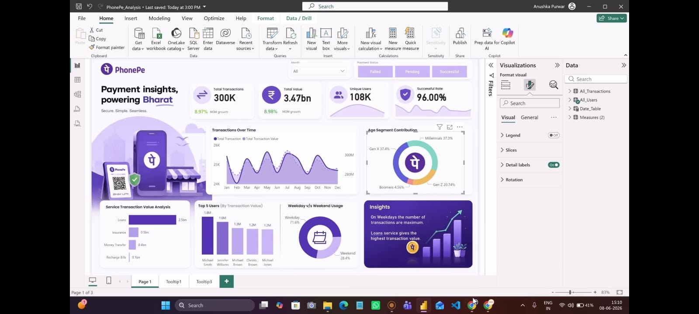

# PhonePe Transaction Analysis Dashboard

## Project Overview
Built an interactive Power BI dashboard to analyze PhonePe transaction data and visualize key business insights.

## Tools Used
- Power BI
- Excel

## Key Features
- Total Transactions
- Total Transaction Value
- Success Rate Analysis
- User Analysis
- Weekend vs Weekday Analysis
- Age Segment Analysis
## Files Included

- PhonePe_Dashboard.jpeg
- PhonePe_Dataset.xlsx

## Dashboard Preview

## Dataset

The dataset used for this project is included in this repository as `PhonePe_Dataset.xlsx`.
